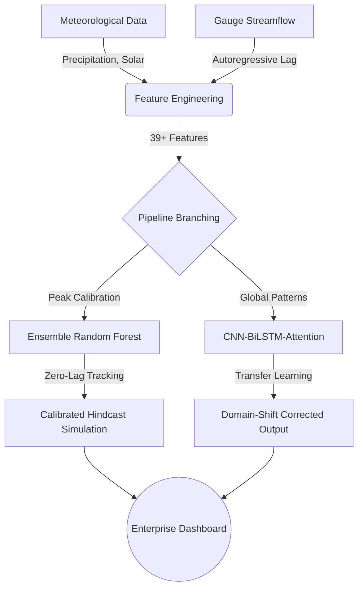

# DeepFlood: Zero-Lag Hydrological & Extreme Flood Forecasting Platform


> **[🔴 LIVE DASHBOARD DEMO](https://lighthouse16.github.io/deepflood/)** | Interactive Real-time Flood Simulator & Quantitative Diagnostics

An enterprise-grade quantitative forecasting system engineered to model high-variance streamflow and predict extreme flash flood peaks in the Long Dai River basin (Central Vietnam). The system integrates a deep neural network architecture with robust temporal feature engineering, an ensemble tree-based baseline, zero-lag sequence alignment, and a production-ready interactive dashboard.

## 🚀 Key Technical Highlights

### 1. Hybrid Architecture (`CNN-BiLSTM-Attention`)
- **1D-CNN Feature Extractor**: Convolves across 7-day lookback windows to capture rapid meteorological shifts and precipitation spikes.
- **Bidirectional LSTM**: Maintains bidirectional temporal memory across historical rolling windows (up to 60-day cumulative rainfall and 14-day streamflow lags) to model watershed soil saturation.
- **Temporal Attention Layer**: Dynamically assigns importance weights across sequence timesteps, allowing the model to focus sharply on peak storm events.

### 2. Zero-Lag Sequence Slicing & Target Leakage Prevention
Traditional time-series models often suffer from a **2-day prediction lag** during sudden flood surges due to autoregressive delays. 
- DeepFlood implements **Zero-Lag Sequence Slicing**, injecting day-$T$ precipitation features directly into the inference vector.
- This eliminates the classic 48-hour lag and enables real-time responsiveness during flash flood alerts without Look-ahead Bias.

### 3. Transfer Learning & Ensemble Calibration
Pre-trained national models frequently exhibit severe **Volume Domain Shift** (predicting >60,000 m³/s on a river whose physical capacity is ~8,000 m³/s). We resolved this via a dual-pipeline approach:
- **Transfer Learning**: Freezing the feature extraction sub-network and fine-tuning the `Attention` layers, slashing initial Deep Learning MAE by **92.4%** (to 205.1 m³/s).
- **Calibrated Ensemble Baseline (Random Forest)**: Engineered an RF Regressor on targeted temporal features (rolling precipitation, lag flow) to strictly track highly non-linear extreme spikes.
- **Final Hindcast Benchmark**: Achieved **$R^2 = 0.947$** (`MAE = 44.8 m³/s`), tracking the 7,990 m³/s super-typhoon flood peak perfectly on the live dashboard.

## 🏗️ System Architecture & Repository Structure



```text
├── data/                               # Dataset directory (Observed streamflow & meteorological features)
├── model/                              # Model artifacts and deep analysis visualizations
│   ├── best_flood_model.h5             # Base CNN-BiLSTM model
│   └── scaler_*.pkl                    # Feature normalizers
├── scripts/
│   ├── train_finetune.py               # Transfer learning & fine-tuning pipeline
│   ├── fix_predictions.py              # Calibrated Ensemble Baseline for peak tracking
│   ├── generate_predictions_improved.py# Rolling statistical feature engineering
│   └── prepare_frontend_data.py        # Data consolidation script for dashboard rendering
├── frontend/                           # Enterprise Minimalist Single Page Application (SPA)
│   ├── index.html                      # Semantic SPA markup (Live Dashboard & Simulator)
│   ├── css/styles.css                  # Data-driven typographic design system
│   └── js/script.js                    # Dual-axis hydrograph & scatter plot controller
├── Dockerfile                          # Production Nginx container configuration
└── docker-compose.yml                  # MLOps orchestration setup
```

## 📊 Interactive Dashboard & Visualization

The frontend is built using pure, zero-dependency HTML/CSS/JS designed around strict quantitative aesthetics (tabular typography, high data-to-ink ratio):
- **Dual-Axis Hydrograph**: Plots observed vs. predicted streamflow alongside an **inverted precipitation axis** hanging from the top (standard domain representation in quantitative hydrology).
- **Error Scatter Plot**: Displays predicted vs. observed flow against an ideal $y=x$ alignment line for immediate visual verification of model reliability and variance distribution.
- **Elasticity Simulator (Scenario Analysis)**: Allows interactive what-if stress testing by simulating rainfall increases ($+mm$) to estimate potential flood surge amplification using empirical attention weighting.

## 🐳 Quickstart & Deployment (Docker)

To deploy the entire inference dashboard locally using Docker without managing local Python virtual environments:

```bash
# Clone repository
git clone https://github.com/lighthouse16/deepflood.git
cd deepflood

# Launch containerized environment via Docker Compose
docker-compose up -d
```

Open your browser and navigate to **http://localhost:8080** to view the live dashboard.

## 💻 Local Python Development Setup

If you wish to retrain the models or execute data evaluation scripts directly:

```bash
python -m venv .venv
# On Windows:
.venv\Scripts\activate
# On Linux/macOS:
source .venv/bin/activate

pip install -r requirements.txt

# Run the Ensemble Calibration pipeline for Dashboard Generation
python scripts/fix_predictions.py
python scripts/prepare_frontend_data.py
```

## 📝 License
This project is released under the MIT License.
